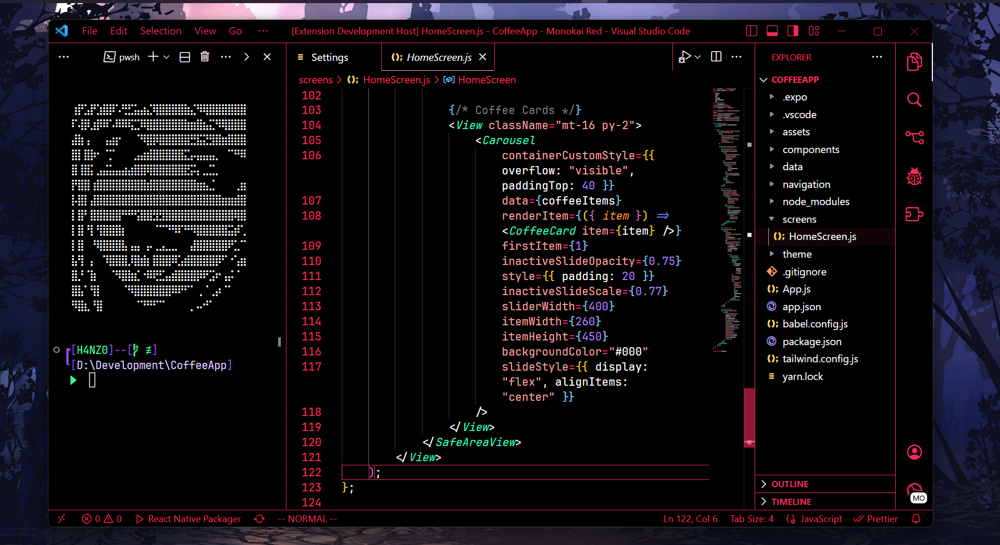

# Arasaka VS Theme


Arasaka VS Theme is a stylish and immersive Visual Studio Code theme inspired by the cyberpunk aesthetic of the Arasaka Corporation in the Cyberpunk 2077 universe. This theme provides a futuristic and visually pleasing coding experience.

## Installation

1. Launch Visual Studio Code.
2. Go to Extensions (or press `Ctrl+Shift+X`).
3. Search for "Arasaka VS Theme."
4. Click the Install button.

## Features

- Cyberpunk-inspired color scheme.
- Dark and immersive code editor.
- Carefully crafted syntax highlighting.
- Improved code readability.

## Screenshots



## Usage

1. After installing the theme, open Visual Studio Code.
2. Click on the gear icon (⚙️) in the lower-left corner.
3. Choose "Color Theme."
4. Select "Arasaka VS Theme" from the list.

## Customization

You can customize the theme further by modifying your `settings.json` file. Add or override the following settings:

```json
{
  "workbench.colorTheme": "Arasaka VS Theme",
  // Add any additional customization here
}
```

## Feedback and Contributions

If you encounter any issues or have suggestions for improvements, please open an issue.

Contributions are welcome! If you'd like to contribute to this theme, please fork the repository and submit a pull request.
License

This theme is licensed under the MIT License.

Enjoy coding in style with Arasaka VS Theme! 🌟

## Made By


